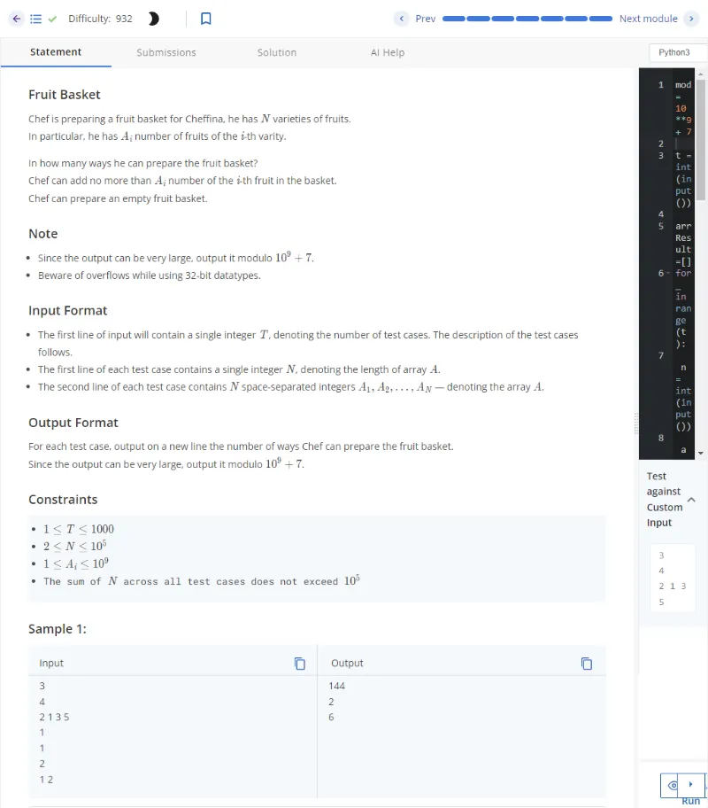
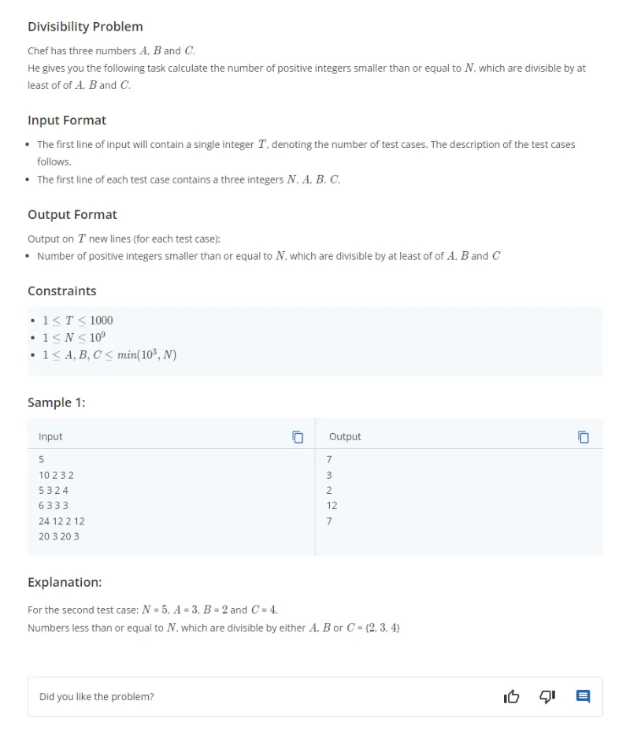
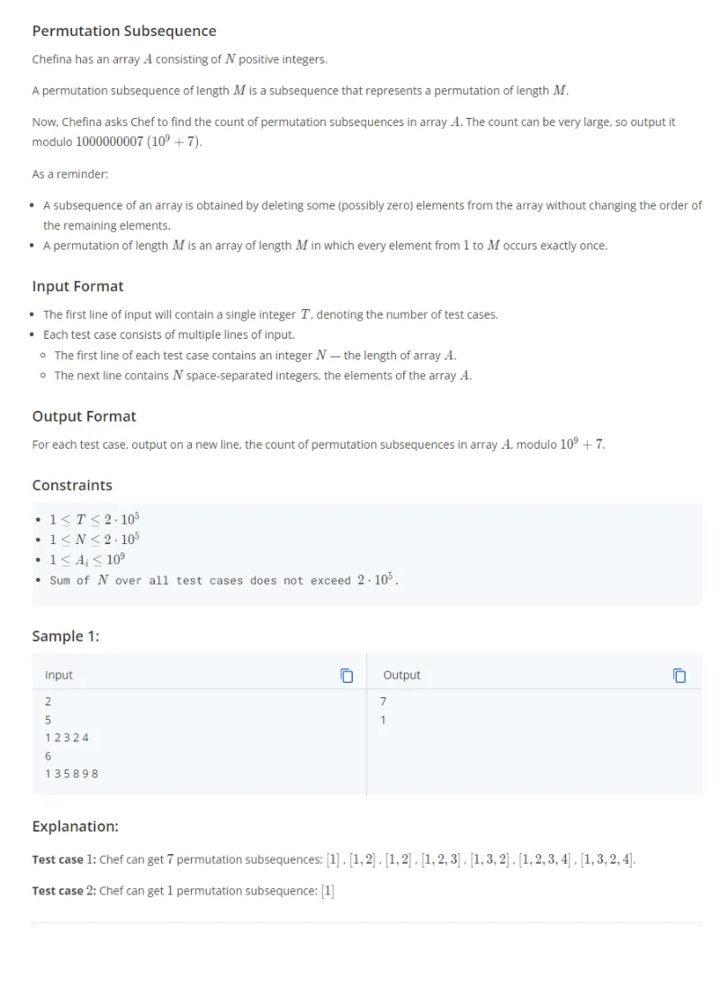
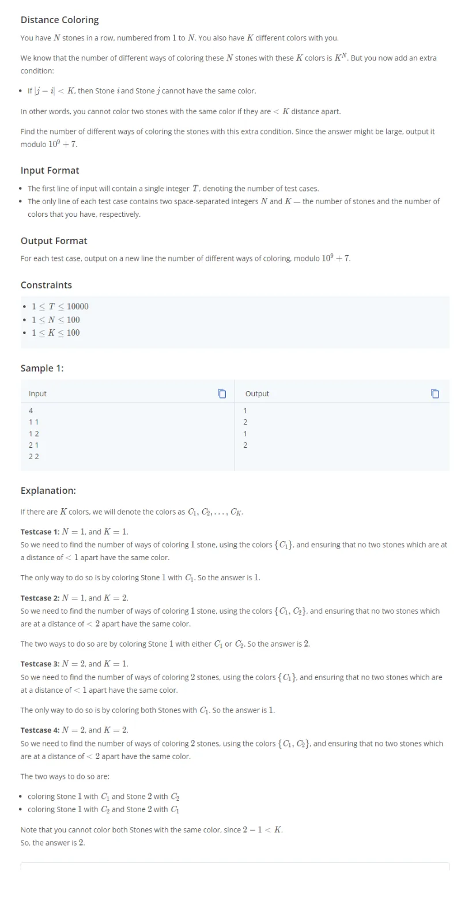
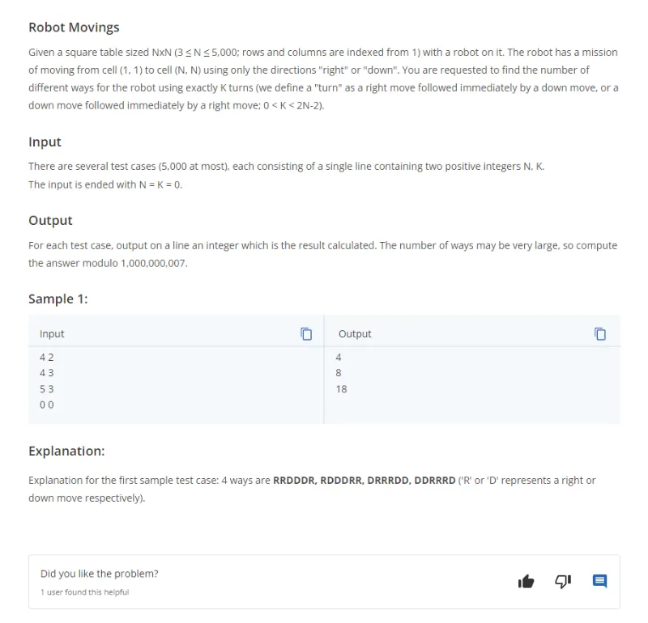
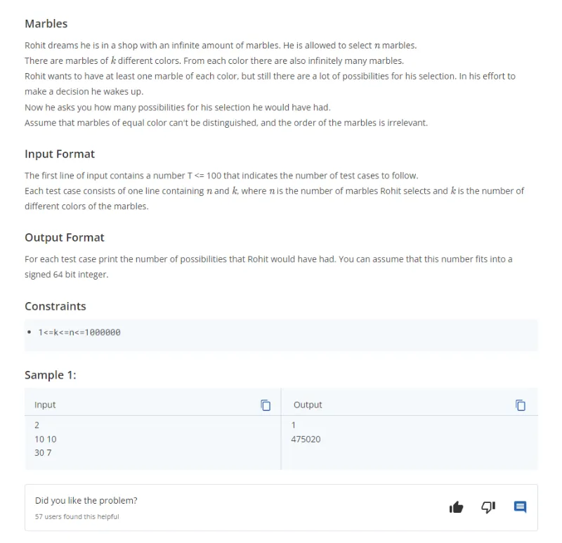

# Combinatorics: Explicación de cada solución realizada

## Tabla de Contenidos

- [Combinatorics: Explicación de cada solución realizada](#combinatorics-explicación-de-cada-solución-realizada)
  - [Tabla de Contenidos](#tabla-de-contenidos)
  - [Problemas](#problemas)
    - [1. Fruit Basket](#1-fruit-basket)
      - [1.1.Descripción](#11descripción)
      - [1.2. Explicación y Solución](#12-explicación-y-solución)
    - [2. Divisibility Problem](#2-divisibility-problem)
      - [2.1.Descripción](#21descripción)
      - [2.2. Explicación y Solución](#22-explicación-y-solución)
    - [3. Word Counting](#3-word-counting)
      - [3.1.Descripción](#31descripción)
      - [3.2. Explicación y Solución](#32-explicación-y-solución)
    - [4. Permutation Subsequence](#4-permutation-subsequence)
      - [4.1.Descripción](#41descripción)
      - [4.2. Explicación y Solución](#42-explicación-y-solución)
    - [5. Distance Coloring](#5-distance-coloring)
      - [5.1.Descripción](#51descripción)
      - [5.2. Explicación y Solución](#52-explicación-y-solución)
    - [6. Robot Movings](#6-robot-movings)
      - [6.1.Descripción](#61descripción)
      - [6.2. Explicación y Solución](#62-explicación-y-solución)
    - [7. Marbles](#7-marbles)
      - [7.1.Descripción](#71descripción)
      - [7.2. Explicación y Solución](#72-explicación-y-solución)

## Problemas

### 1. Fruit Basket

#### 1.1.Descripción



#### 1.2. Explicación y Solución

Sea el caso que tengo dos frutas de tipo 1 (t1 y t1) y dos frutas de tipo 2 (t2 y t2) entonces se pueden formar los siguientes casos diferentes:

- Puedo sacar una fruta del tipo 1 y ninguna fruta del tipo 2
- Puedo sacar una fruta del tipo 1 y una fruta del tipo 2
- Puedo sacar una fruta del tipo 1 y dos frutas del tipo 2
- Puedo sacar dos frutas del tipo 1 y ninguna fruta del tipo 2
- Puedo sacar dos frutas del tipo 1 y una fruta del tipo 2
- Puedo sacar dos frutas del tipo 1 y dos frutas del tipo 2
- Puedo sacar ninguna fruta del tipo 1 y ninguna fruta del tipo 2
- Puedo sacar ninguna fruta del tipo 1 y una fruta del tipo 2
- Puedo sacar dos frutas del tipo 1 y dos frutas del tipo 2

El total de casos es entonces 3\*3 que implica sacar 0,1 ó dos frutas del tipo 1 multiplicado por 0,1 o dos frutas del tipo 2. Lo mismo sucedería para el caso general: sacar 0,1,....,i1 frutas del tipo 1, sacar 0,1,...,i2 frutas del tipo 2, sacar 0,1,...,i3 frutas del tipo 3 y así hasta la fruta del tipo n, entonces el total de selecciones diferentes de cantidades de frutas seleccionadas es:

(1+i_2)(1+i_3)\cdots(1+i_n)>)

```py
mod = 10**9 + 7

t = int(input())

arrResult=[]
for _ in range(t):
    n = int(input())
    a = list(map(int, input().split()))

    # Write your solution here
    res=1
    for elem in a:
        res*=(elem+1)
    arrResult.append(res%mod)

for elem in arrResult:
    print(elem)
```

### 2. Divisibility Problem

#### 2.1.Descripción



#### 2.2. Explicación y Solución

La solución implementada hace uso del principio de inclusión y exclusión considerando que la cantidad de números divisibles por **a** y **b**, a la vez, en el rango desde **1 a N** es igual a:

}\right\rfloor>)

Donde **mcm** corresponde al mínimo común múltiplo entre **a** y **b**.

Y la cantidad de números divisibles por **a**, **b** y **c**, a la vez, en el rango desde **1 a N** es igual a:

}\right\rfloor>)

Por tanto, la cantidad de números divisibles por **a** ó **b** ó **c** en el rango de **1 a N**, es decir, la cantidad de números divisibles por al menos un número **a** ó **b** ó **c** en el rango de **1 a N** es igual a:

- Cantidad de elementos divisibles **a** en el rango de 1 a N
- Más la cantidad de elementos divisibles **b** en el rango de 1 a N
- Más la cantidad de elementos divisibles **c** en el rango de 1 a N
- Menos la cantidad de elementos divisibles por **a** y **b** en el rango de 1 a N
- Menos la cantidad de elementos divisibles por **b** y **c** en el rango de 1 a N
- Menos la cantidad de elementos divisibles por **a** y **c** en el rango de 1 a N
- Más la cantidad de elementos divisibles por **a**, **b** y **c** en el rango de 1 a N

}\right\rfloor-\left\lfloor\frac{N}{\mathrm{mcm}(b,c)}\right\rfloor-\left\lfloor\frac{N}{\mathrm{mcm}(a,c)}\right\rfloor+\left\lfloor\frac{N}{\mathrm{mcm}(a,b,c)}\right\rfloor>)

```py
# Function to calculate gcd of 2 integers
def gcd(a, b):
    while b:
        a, b = b, a % b
    return a

# Function to calculate lcm of 2 integers
def lcm(a, b):
    return a * (b // gcd(a, b))

# Function to calculate lcm of 3 integers
def lcm_of_three(a, b, c):
    return lcm(a, lcm(b, c))

t = int(input())

for _ in range(t):
    n, a, b, c = map(int, input().split())
    # Write your code here
    cantidad_a = n // a
    cantidad_b= n // b
    cantidad_c= n // c
    cantidad_a_b=n//lcm(a,b)
    cantidad_a_c=n//lcm(a,c)
    cantidad_b_c=n//lcm(b,c)
    cantidad_a_b_c=n//lcm_of_three(a,b,c)
    cantidad_total=cantidad_a+cantidad_b+cantidad_c-cantidad_a_b-cantidad_a_c-cantidad_b_c+cantidad_a_b_c
    print(cantidad_total)
```

### 3. Word Counting

#### 3.1.Descripción


#### 3.2. Explicación y Solución

La fórmula utilizada es la siguiente:


Sin embargo, lo que se desea calcular es dicho valor en módulo p:


En este caso hago uso del **Pequeño teorema de Fermat** sabiendo el hecho que **p** es un número primo y que la expresión siguiente genera un número entero:


Entonces tengo que si a y b son números enteros tal que a/b es entero, p es un número primo y b y p son coprimos, entonces se cumple lo siguiente:


En este caso, se dice en el problema que cada caracter no esta repetido más de 10 veces en el string entonces la multiplicación de factoriales posee números múltiplos de 1 hasta 10 por lo que no es divisible entre el número 10⁹+7. Es decir, el denominador y el número 10⁹+7 son **coprimos**.

```py
val = 10**9 + 7

factorial_memo={}
def factorial(n):
    if n in factorial_memo:
        return factorial_memo[n]
    if n == 0:
        return 1
    else:
        factorial_memo[n] = n * factorial(n - 1) % val
        return factorial_memo[n]


t = int(input())
for _ in range(t):
    s = input()
    diccionario = {i:diccionario.get(i,0) + 1 for i in s}


    factorial_s = factorial(len(s))
    factorial_veces = 1
    for count in diccionario.values():
        factorial_veces = (factorial_veces * factorial(count)) % val


    # Aplicación del pequeño teorema de fermat
    res = (factorial_s * pow(factorial_veces, val - 2, val)) % val
    print(res)
```

### 4. Permutation Subsequence

#### 4.1.Descripción



#### 4.2. Explicación y Solución

Sea la función **f** tal que permite retornar la cuenta de elementos presentes en el array, entonces la cantidad de secuencias de permutación de largo **m** es igual a la multiplicatoria de cantidad de elementos desde 1 a **m**.

>)

Por tanto, la cantidad de secuencias de permutaciones de largo m presentes en el array de largo n es entonces:

\right)>)

El código siguiente genera un array con la cuenta de la cantidad de elementos presentes en el array para cada elemento distinto. Tal array permite acceder a la cuenta en tiempo de complejidad O(1) y luego creo el array de multiplicaciones acumuladas para cada elemento distinto del array y al final realizo la suma de elementos del array de multiplicaciones acumuladas.

```py
val=10**9+7
t=int(input())
for _ in range(t):
    n=int(input())
    arr=list(map(int,input().split()))
    arr_count=[0]*(n+1)
    for elem in arr:
        if elem<=n:
            arr_count[elem]+=1
    prefixMult=[1]*(n+1)
    for i in range(1,n+1):
        prefixMult[i]=prefixMult[i-1]*arr_count[i]%val
    result=0
    for i in range(1,n+1):
        result+=prefixMult[i]%val
    print(result)
```

### 5. Distance Coloring

#### 5.1.Descripción



#### 5.2. Explicación y Solución

Se tienen dos casos posibles: cuando n es mayor o igual a k y cuando k es mayor que n. En el primer caso se tiene que la cantidad de piedras a colorear es mayor que la cantidad de colores distintos y estableciendo la condición se tiene que lo solicitado es igual al factorial de k. Un ejemplo para mostrar lo anterior es el siguiente:

- Si n es 4 y k es 3. Sea C1, C2 y C3 los 3 colores diferentes. Entonces si coloreo la primera piedra del color C1 entonces la segunda piedra no puede ser C1 pero si puede ser C2 o C3, pinto la segunda de C2 entonces la tercera piedra no puede ser ni del color C1 ni del color C2, por lo que solo queda pintarla de C3, quedando por tanto la siguiente secuencia para las primeras tres piedras: C1C2C3. La piedra 4 no puede colorearse ni de C2 ni de C3 quedando solo colorearla del color C1, es decir, la secuencia se repite desde la posición K+1. Dado lo anterior la cantidad de maneras diferentes de pintar las 4 piedras esta determinada solo por la primera secuencia y la cantidad es k factorial.

En el segundo caso se tiene que la cantidad de piedras es menor que la cantidad de colores diferentes. En tal caso la secuencia no alcanza a finalizarse y el total de maneras diferentes de pintar n piedras es igual a la cantidad de colores posibles para pintar la primera piedra (k) por la cantiadad de colores diferentes en pintar la segunda piedra sin considerar el primer color (k-1) por la cantidad de colores diferentes en pintar la tercera piedra sin considerar el primer ni segundo color (k-2) y así hasta que la cantidad de piedras pintadas es igual a n, es decir, hasta la piedra **k-(n-1)** lo que es lo mismo que:

\cdot(k-2)\cdot\ldots\cdot(k-(n-1))>)

Y esto es lo mismo que:

!}>)

La fórmula anterior la aplico con módulo p siendo p un número primo. Como N y K estan dentro de 1 a 100 en base a las restricciones del problema, entonces el denominador no posee ningún factor común con el número primo 10⁹+7 siendo entonces coprimos y además como la fracción es un número entero, es posible aplicar el **Pequeño Teorema de Fermat** de la misma manera que se hizo en el ejercicio 3.

```py
val=10**9+7

factorial_memo={}
def factorial(n):
    if n in factorial_memo:
        return factorial_memo[n]
    if n == 0:
        return 1
    else:
        factorial_memo[n] = n * factorial(n - 1) % val
        return factorial_memo[n]

for _ in range(int(input())):
    n,k=map(int,input().split())

    if n>k:
        res=factorial(k)
    if n<=k:
        res=(factorial(k)*pow(factorial(k-n),val-2,val))%val

    print(res)
```

### 6. Robot Movings

#### 6.1.Descripción



#### 6.2. Explicación y Solución

El problema consiste en obtener todas las rutas posibles diferentes de movimientos de un robot en un tablero de tamaño n por n comenzando desde la posición (1,1) hasta la posición (n,n) de manera tal que existan K swaps,es decir, K cambios de rutas. Los movimientos posibles solo son hacia la derecha y hacia abajo. Para ver la caracterización del problema de manera más concreta utilizaré un tablero de 10 por 10 y la cantidad de swaps necesarios será de 6. Si mi primer movimiento es hacia a la derecha (R) entonces, para que se cumpla la cantidad de 6 swaps, tengo que la secuencia debe ser semejante a esto:

- **RDRDRDR**

Donde se ha utilizado R y D para denominar series de movimientos iguales a la derecha y hacia abajo, respectivamente, no necesariamente del mismo largo, es decir, el primer R puede contener 5r y el segundo puede contener 2r. La secuencia anterior me genera 6 swaps divididos en 3 swaps de R a D y 3 swaps de D a R. Ahora bien, como el tablero es de 10 por 10 entonces poseo 9 movimientos hacia la derecha y hacia abajo, respectivamente. El problema se reduce a lo siguiente:

Si poseo 9 movimientos hacia la derecha: RRRRRRRRR debo colocar 3 **separadores** en los espacios entre el primer y último R (en total 8 espacios). Lo anterior genera la cantidad de separaciones posibles de R para formar los grupos. En otras palabras lo que se requiere es seleccionar 3 espacios de 8 espacios disponibles y la fórmula es:


Ahora bien, me queda calcular la cantidad de grupos de D al colocar separadores. Del total de Ds posibles que es: DDDDDDDDD y para ello necesito generar swaps de D a R, es decir, colocar 2 separadores entre el primer y último D. La fórmula para ello es la siguiente:


Por lo tanto, cuando el primer movimiento es hacia la derecha(r) la cantidad total de diferentes movimientos con 6 swaps es:


Ahora debo realizar el mismo procedimiento para cuando el primer movimiento es hacia abajo(d). La explicación para este caso es la misma anterior pero ahora sustituyendo R por D y D por R. En tal caso la cuenta es la misma:


Y el resultado pedido es la suma de ambas:


Para el caso general, se observa que si k es par, la cantidad de swaps de R a D es k/2 y la cantidad de swaps de D a R es k/2. Para el primer movimiento hacia la derecha, la fórmula total es entonces:


Y la cantidad de movimientos posibles tal que existan K swaps cuando K es par es:


Si k es impar, entonces si tengo un tablero de 10 por 10 y k sea, por ejemplo, 7. Si mi primer movimiento es hacia la derecha, la secuencia correcta para 7 swaps es: **RDRDRDRD**. Por tanto, necesito colocar 3 separadores en la cantidad de espacios de movimientos totales hacia la derecha (RRRRRRRRR) y 3 separadores en la cantidad de espacios de movimientos totales hacia abajo. La fórmula para ello es la siguiente:


La misma cantidad es para el caso en que el primer movimiento es hacia abajo. Por lo que la cantidad total de movimientos posibles con 7 swaps es la siguiente:


Para el caso general, cuando k es impar. Si el primer movimiento es hacia la derecha, entonces se termina siempre con un D y la cantidad swaps de R a D esta dada por k//2+1 y la cantidad swaps de D a R esta dada por k//2. La cantidad de separadores en el total de movimientos hacia la derecha es: k//2. La cantidad de separadores en el total de movimientos hacia abajo es: k//2. Por tanto, la fórmula general cuando k es impar es la siguiente:


Donde // denota la división parte entera.

Por tanto, si k es par tengo que la fórmula es:


Y si k es impar tengo que la fórmula es:


De la identidad siguiente:

(k-1)//2 es igual a k//2 si k es impar y es igual a k//2 - 1 cuando k es par entonces la fórmula general se puede simplificar a esto:

//2}>)

para k par o impar.

```py
mod = 10**9 + 7
N = 5001


combinations = [[0]*N for _ in range(N)]

def dp_combinations():
    for n in range(N):
        combinations[n][0] = 1
        for k in range(1, n + 1):
            combinations[n][k] = (combinations[n - 1][k - 1] + combinations[n - 1][k]) % mod


dp_combinations()

while True:
    n, k = map(int, input().split())
    if n == 0 and k == 0:
        break
    if k>=2*(n-1):
        print(0)
        continue
    bar=k//2
    if k%2==0:
        result = (combinations[n - 2][bar] * 2 * combinations[n - 2][bar-1]) % mod
    else:
        result = (combinations[n - 2][bar] * 2 * combinations[n - 2][bar]) % mod
    print(result)
```

### 7. Marbles

#### 7.1.Descripción



#### 7.2. Explicación y Solución

Hay n marbles a seleccionar y k colores diferentes, si se debe seleccionar **al menos un color**, **el orden no es relevante** y los **marbles del mismo color son indistinguibles** entre ellos el problema se reduce. Sea n igual a 6 marbles y 3 son los colores diferentes entonces tengo este diagrama:

- **m m m m m m**

Entonces debo formar 3 grupos diferentes con al menos 1 elemento de un color. Por tanto, en los 5 espacios disponibles debo colocar dos separadores, es decir, debo contar las combinaciones diferentes al seleccionar 2 espacios de 5 espacios en total y la fórmula para ello es la siguiente:


Por ejemplo, si selecciono el primer y segundo espacio como separadores entonces la secuencia de colores es: C1 C2 C3C3C3C3, si selecciono el penúltimo y último espacio entonces la secuencia posible de colores es: C1C1C1C1 C2 C3 y si selecciono el primer y último espacio entonces la secuencia posibles de colores es: C1 C2C2C2C2 C3

Para el caso general, el total de espacios es n-1 y la cantidad de espacios a seleccionar del total de espacios disponibles es igual a k-1 lo cual me genera k grupos donde al menos hay un color y la fórmula para ello es:


PD: Este es un ejemplo del [**problema de barras y estrellas**](<https://es.wikipedia.org/wiki/Barras_y_estrellas_(combinatoria)>) el cual utiliza "espacios" para realizar la cuenta.

```py
from math import comb

for _ in range(int(input())):
    n,k=map(int,input().split())
    # se colocan k-1 separadores en n-1 espacios asegurando que se deja al menos 1 color
    result = comb(n-1, k-1)
    print(result)
```
