# Explicaciones de todos los problemas resueltos

## Tabla de Contenidos

- [Explicaciones de todos los problemas resueltos](#explicaciones-de-todos-los-problemas-resueltos)
  - [Tabla de Contenidos](#tabla-de-contenidos)
  - [Problemas](#problemas)
    - [Problema 1: Creating Prefix Array](#problema-1-creating-prefix-array)
      - [Explicación](#explicación)
    - [Problema 2: Optimization Using Prefix Array](#problema-2-optimization-using-prefix-array)
      - [Explicación](#explicación-1)
    - [Problema 3: Good subarrays](#problema-3-good-subarrays)
      - [Explicación](#explicación-2)
    - [Problema 4: Counting Pretty Numbers](#problema-4-counting-pretty-numbers)
      - [Explicación](#explicación-3)
    - [Problema 5: Little Chef and Sums](#problema-5-little-chef-and-sums)
      - [Explicación](#explicación-4)
    - [Problema 6: Good Subarrays 2](#problema-6-good-subarrays-2)
      - [Explicación](#explicación-5)
    - [Problema 7: Suffix Arrays](#problema-7-suffix-arrays)
      - [Explicación](#explicación-6)
    - [Problema 8: Mystical Numbers](#problema-8-mystical-numbers)
      - [Explicación](#explicación-7)
    - [Problema 9: Optimal Denomination](#problema-9-optimal-denomination)
      - [Explicación](#explicación-8)
    - [Problema 10: Binod](#problema-10-binod)
      - [Explicación](#explicación-9)
    - [Problema 11:-Rectangular Queries](#problema-11-rectangular-queries)
      - [Explicación](#explicación-10)
    - [Problema 12: Again XOR problem](#problema-12-again-xor-problem)
      - [Explicación](#explicación-11)
    - [Problema 13: Segmentation Fault](#problema-13-segmentation-fault)
      - [Explicación](#explicación-12)
    - [Problema 14: Triplets Min](#problema-14-triplets-min)
      - [Explicación](#explicación-13)

## Problemas

### Problema 1: Creating Prefix Array

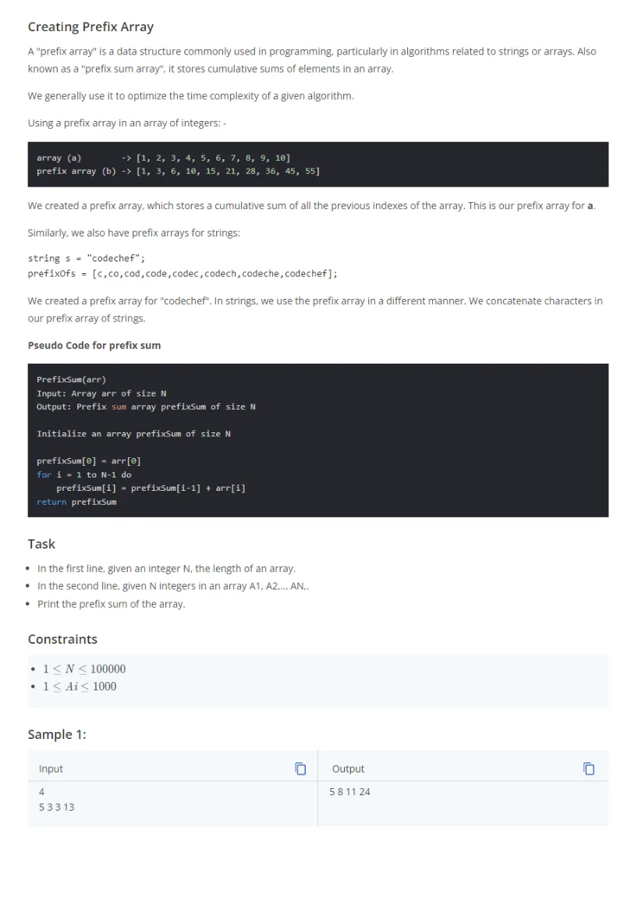

#### Explicación

Se crea un array de largo n+1 con solo números cero (en general, se utiliza el elementro neutro de la operación que se esta realizando en los cálculos de prefix). Luego a partir del indice 1 hasta el índice n se procede a calcular las sumas acumuladas.

```py
n=int(input())
arr=list(map(int,input().split()))

prefix=[0]*(n+1)
for i in range(n):
    prefix[i+1]=prefix[i]+arr[i]
    print(prefix[i+1],end=' ')
```

### Problema 2: Optimization Using Prefix Array

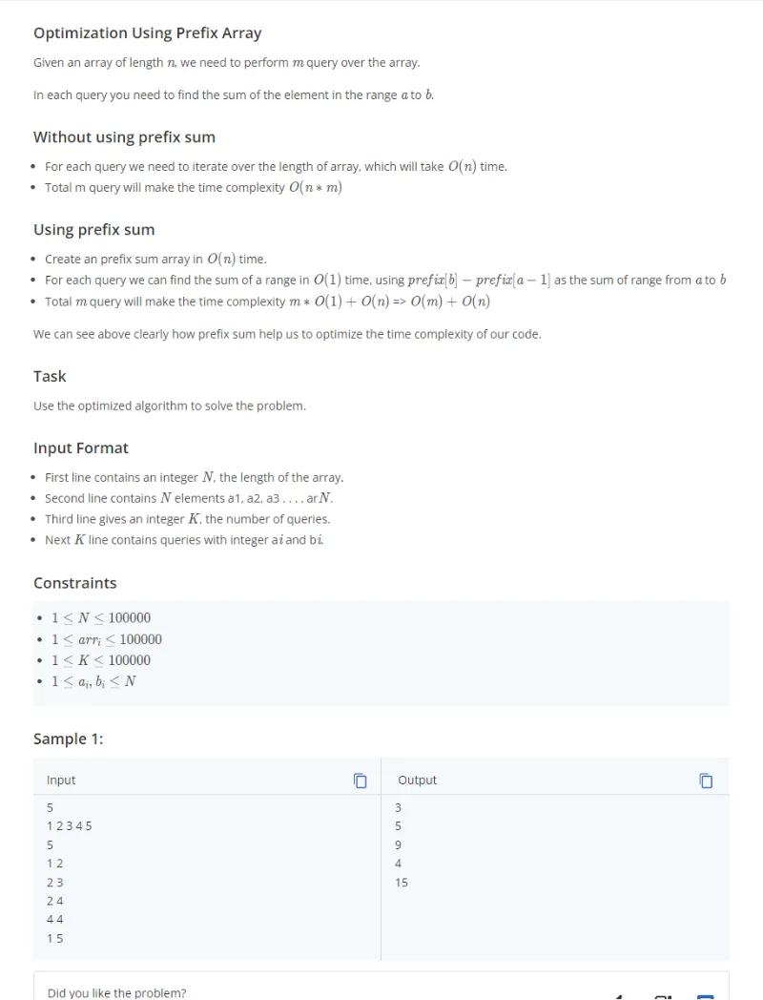

#### Explicación

Se observa que cada i,j entregada en cada query corresponde a las posiciones partiendo desde 1 hasta n donde n es el número de términos del array. Se procede a crear el array prefixSum aplicando el mismo método que la solución del problema 1 y las sumas buscadas corresponden a la resta entre prefixSum[j]-prefix[i-1]. Lo anterior no genera errores ya que el término en el índice 0 en el array prefixSum es cero, es decir, el elemento neutro de la adición.

```py
n=int(input())
arr=list(map(int,input().split()))
k=int(input())

prefixSum=[0]*(n+1)

for i in range(n):
    prefixSum[i+1]=prefixSum[i]+arr[i]

for query in range(k):
    i,j=map(int,input().split())
    print(prefixSum[j]-prefixSum[i-1])
```

### Problema 3: Good subarrays

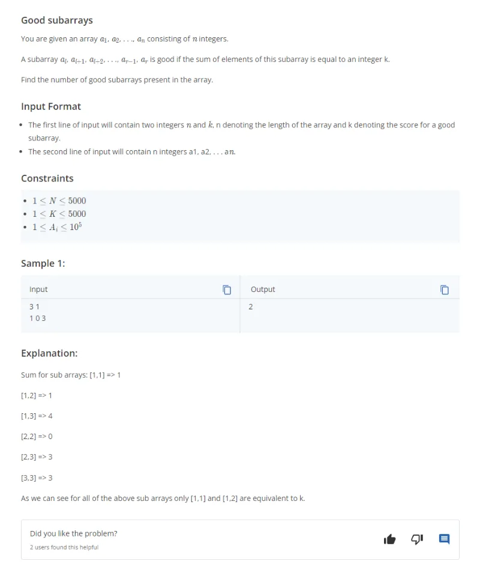

#### Explicación

Sea el array prefixSum de tamaño n+1 y sean i,j dos indices de elementos en dicho array tal que prefixSum[j]-prefixSum[i-1]=k, donde k es el valor que nos entregan y j corresponde a las posiciones de cada elemento en el array original comenzando desde 1 a n. Se observa que se solicita lo siguiente:

- Sea j=1 entonces se debe verificar para i=1 si prefixSum[1]-prefixSum[0]=k. Es decir, prefixSum[1]-k=prefixSum[0]

- Sea j=2 entonces se debe verificar para i=1 e i=2 si prefixSum[2]-prefixSum[1]=k o prefixSum[2]-prefixSum[0]=k. Es decir, prefixSum[2]-k=prefixSum[1] o prefixSum[2]-k=prefixSum[0]

- Sea j=3 entonces se debe verificar para i=1,2 y 3 si prefixSum[3]-prefixSum[2]=k, prefixSum[3]-prefixSum[1]=k o prefixSum[3]-prefixSum[0]=k. Es decir, prefixSum[3]-k=prefixSum[2], prefixSum[3]-k=prefixSum[1] o prefixSum[3]-k=prefixSum[0]

- Y así sucesivamente.

Se observa que si almaceno las veces en que aparece cada prefixSum y verifico que la resta prefixSum[j]-k aparezca en dicho registro a medida que recorro el array prefixSum comenzando desde el indice 1, entonces si creo un contador que vaya agregando dichas veces, al terminar de recorrer el array obtengo la cantidad de subarrays de indices contiguos tal que su suma es igual a k. Para efectos de almacenar las veces en que una prefixSum aparece, creo un diccionario donde sus keys son las prefixSum y la clave es el número de veces en que aparece dicho valor en el array prefixSum. Se inicia el diccionario con la key prefixSum[0]=0 con valor igual a 1.

```py
n,k=map(int,input().split())
arr=list(map(int,input().split()))

prefix={0:1}
currentSum=0
count=0

for i in range(n):
    currentSum+=arr[i]
    if currentSum-k in prefix:
        count+=prefix[currentSum-k]
    if currentSum in prefix:
        prefix[currentSum]+=1
    else:
        prefix[currentSum]=1

print(count)
```

### Problema 4: Counting Pretty Numbers

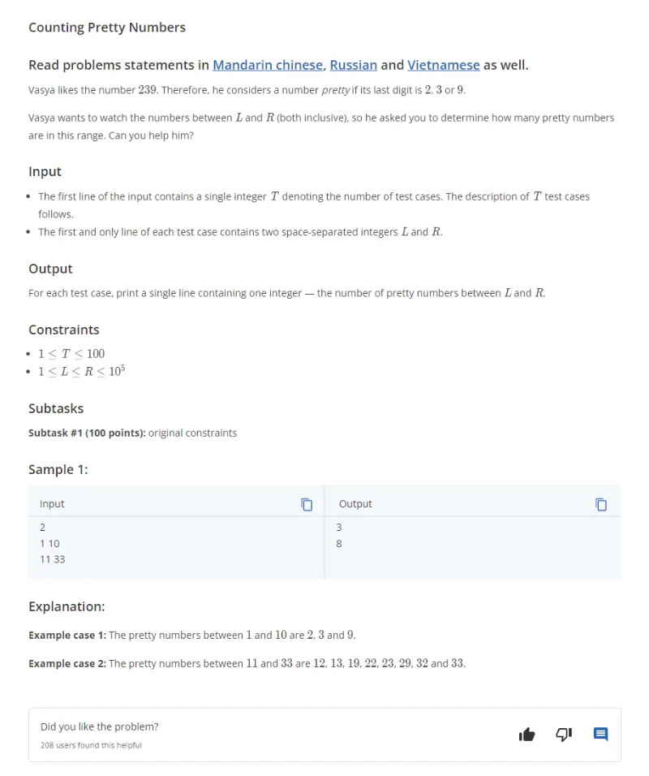

#### Explicación

Se dan dos números y se quiere obtener la cuenta de números que hay entre ambos (incluyendo a ambos) que términan con 2, 3 ó 9. El enfoque de solución es obtener la cota de números términados en 0 obtenidos como la resta entre el número y residuo que queda de dividir el número entre 10. La cuenta de números terminados con 2,3 ó 9 entre tales números se obtiene como la resta entre ambos números dividos entre 10 y multiplicados por 3. Luego dicha cuenta se procede a ajustar en función del valor de los residuos.

```py
T=int(input())
arr=[tuple(map(int,input().split())) for _ in range(T)]

for l,r in arr:
    count=0
    residuoLeft=l%10
    residuoRight=r%10

    newLeft=l-residuoLeft
    newRight=r-residuoRight

    count=((newRight-newLeft)//10)*3

    if residuoLeft>=4:
        count-=2
    if residuoLeft==3:
        count-=1

    if residuoRight==2:
        count+=1
    if residuoRight>=3 and residuoRight<9:
        count+=2
    if residuoRight==9:
        count+=3
    print(count)
```

### Problema 5: Little Chef and Sums

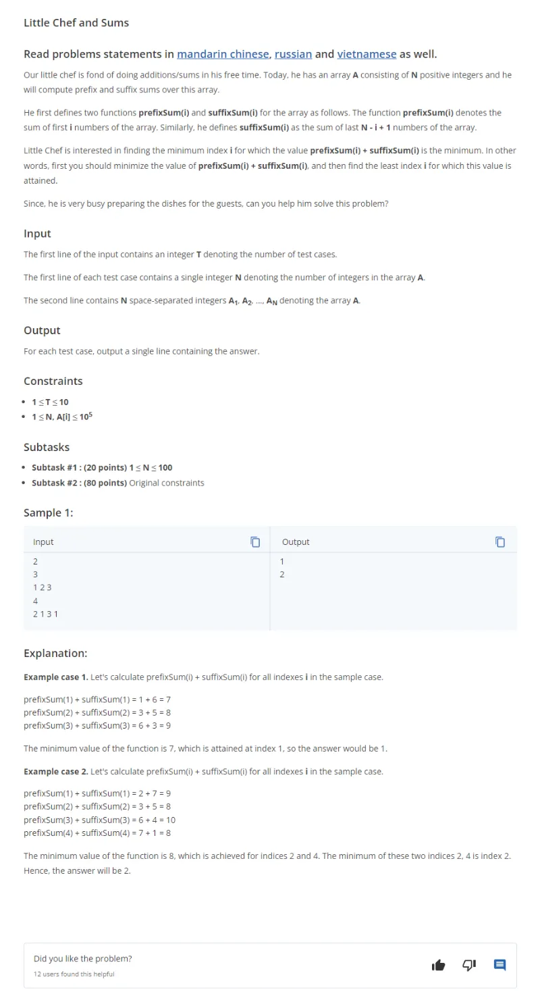

#### Explicación

Inicialmente se obtienen los primeros elementos de cada operación prefix y suffix para luego ir actualizando dichos valores acumulados a medida que se recorre cada elemento del array. Luego de actualizar tales valores, se verifica si la suma de ambos es menor que el valor mínimo el cual se considero como mínimo inicial igual a la suma de los primeros elementos de la operación prefix y suffix. Si es menor que dicho mínimo, entonces se actualiza el valor mínimo y se actualiza el índice donde ocurrio dicho mínimo.

```py
t=int(input())

arrs=[]
for _ in range(t):
    n=int(input())
    arrs.append(list(map(int,input().split())))

def calculateMinSumIndex(arr):
    n=len(arr)
    if n==0:
        return -1

    prefixSum=arr[0]
    suffixSum=sum(arr)
    minSum=prefixSum+suffixSum
    indexMin=0

    for i in range(1,n):
        prefixSum+=arr[i]
        suffixSum-=arr[i-1]
        if prefixSum+suffixSum<minSum:
            minSum=prefixSum+suffixSum
            indexMin=i

    return indexMin+1

for arr in arrs:
    print(calculateMinSumIndex(arr))
```

### Problema 6: Good Subarrays 2

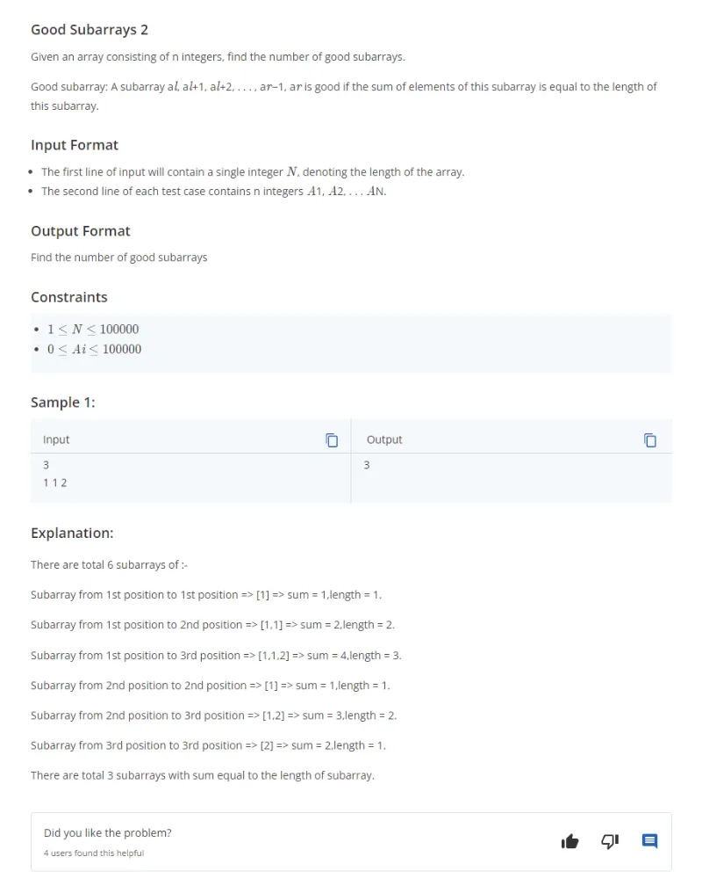

#### Explicación

Este problema es muy similar al problema 3.

Sea el array prefixSum de tamaño n+1 y sean i,j dos indices de elementos en dicho array tal que prefixSum[j]-prefixSum[i-1]=j-(i-1), donde j corresponde a las posiciones de cada elemento en el array original comenzando desde 1 a n. Se observa que se solicita lo siguiente:

- Sea j=1 entonces se debe verificar para i=1 si prefixSum[1]-prefixSum[0]=1-0. Es decir, prefixSum[1]-1=prefixSum[0]-0

- Sea j=2 entonces se debe verificar para i=1 e i=2 si prefixSum[2]-prefixSum[1]=2-1 o prefixSum[2]-prefixSum[0]=2-0. Es decir, prefixSum[2]-2=prefixSum[1]-1 o prefixSum[2]-2=prefixSum[0]-0

- Sea j=3 entonces se debe verificar para i=1,2 y 3 si prefixSum[3]-prefixSum[2]=3-2, prefixSum[3]-prefixSum[1]=3-1 o prefixSum[3]-prefixSum[0]=3-0. Es decir, prefixSum[3]-3=prefixSum[2]-2, prefixSum[3]-3=prefixSum[1]-1 o prefixSum[3]-3=prefixSum[0]-0

- Y así sucesivamente.

Se observa que si almaceno las veces en que aparece cada prefixSum-i y verifico que la resta prefixSum[j]-j aparezca en dicho registro a medida que recorro el array prefixSum comenzando desde el indice 1, entonces si creo un contador que vaya agregando dichas veces, al terminar de recorrer el array obtengo la cantidad de subarrays de indices contiguos tal que su suma es igual al largo de dicho subarray. Para efectos de almacenar las veces en que una prefixSum-i aparece, creo un diccionario donde sus keys son las prefixSum-i y la clave es el número de veces en que aparece dicho valor en el array prefixSum. Se inicia el diccionario con la key prefixSum[0]-0=0 con valor igual a 1.

```py
n=int(input())
arr=list(map(int,input().split()))

countDiff={0:1}
currentSum=0
count=0

for i in range(n):
    currentSum+=arr[i]
    if currentSum-(i+1) in countDiff:
        count+=countDiff[currentSum-(i+1)]
        countDiff[currentSum-(i+1)]+=1
    else:
        countDiff[currentSum-(i+1)]=1

print(count)
```

### Problema 7: Suffix Arrays

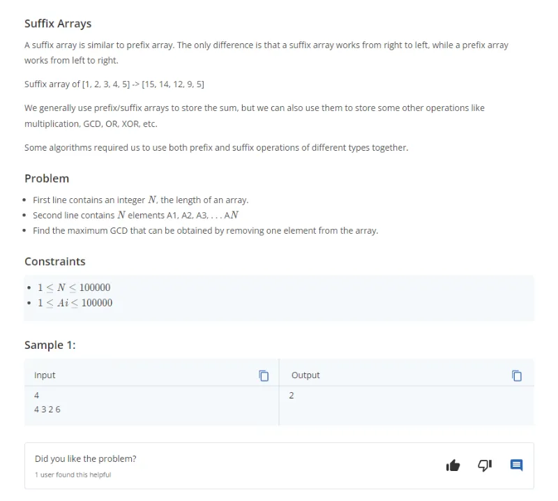

#### Explicación

Se pide encontrar el máximo valor de los máximos común divisor de los elementos que resultan de remover un elemento del array. Se procede a crear un prefixGCD y suffixCGD los cuales calculan el máximo común divisor desde el primer término hacia el elemento final y desde el elemento final al primer elemento, respectivamente. Luego se recorren el array principal y se va calculando el máximo común divisor para el elemento de posición i del array principal como el máximo común divisor entre prefix[i-1] y suffix[i+1].

```py
from math import gcd as getMCD
n=int(input())
arr=list(map(int,input().split()))


prefixGCD=[0]*n
suffixGCD=[0]*n
for i in range(n):
    if i==0:
        prefixGCD[i]=arr[i]
        suffixGCD[n-1-i]=arr[n-1-i]
    else:
        prefixGCD[i]=getMCD(prefixGCD[i-1],arr[i])
        suffixGCD[n-1-i]=getMCD(suffixGCD[n-1-i+1],arr[n-1-i])

maxGCD=suffixGCD[0]

for i in range(1,n-1):
    mcd=getMCD(suffixGCD[i+1],prefixGCD[i-1])
    maxGCD=max(maxGCD,mcd)

maxGCD=max(maxGCD,prefixGCD[n-2])
print(maxGCD)
```

Existe otra manera que permite evitar el manejar casos particulares para los extremos al ya considerar los extremos en la creación de los array prefix y suffix como aquellos elementos neutros de la operación máximo común divisor el cual es cero:

```py
from math import gcd as getMCD
n=int(input())
arr=list(map(int,input().split()))

prefixGCD=[0]*(n+1)
suffixGCD=[0]*(n+1)


for i in range(n):
    prefixGCD[i+1]=getMCD(prefixGCD[i],arr[i])
for i in range(n-1,-1,-1):
    suffixGCD[i]=getMCD(suffixGCD[i+1],arr[i])

maxGCD=float('-inf')

for i in range(n):
    mcd=getMCD(prefixGCD[i],suffixGCD[i+1])
    maxGCD=max(maxGCD,mcd)

print(maxGCD)

```

### Problema 8: Mystical Numbers

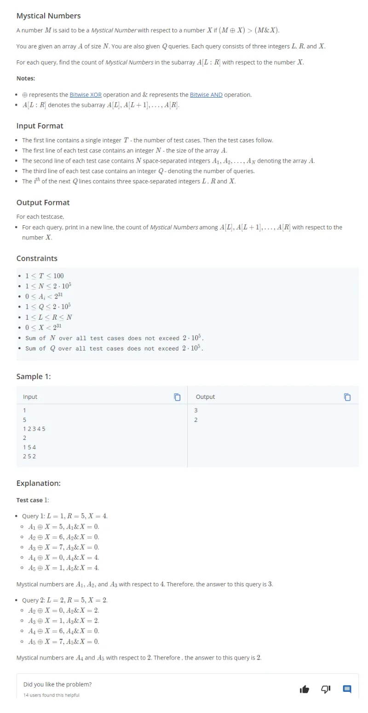

#### Explicación

Problema que se simplifica al advertir lo siguiente: sean A y X dos números positivos tal que bA y bX son las posiciones de los bits más significativos de ambos números. Si bA > bX o bA < bX, entonces A XOR X > A AND X ya que bA XOR bX es igual a 1 y bA AND bX es igual 0. Si bA es igual a bX, entonces A XOR X < A AND X ya que bA XOR bX es 0 y bA AND bX es igual 1. Queda el caso en que A o X son cero. Si A es cero y X es cero, entonces A XOR X es igual a A AND X. Si A es cero y X no es cero o A no es cero y X es cero, entonces A XOR X > A AND X. En resumen, si las posiciones de los bit más significativos son distintas, entonces A XOR X > A AND X y si son iguales entonces se cumple que A XOR X es menor o igual a A AND X. Ahora bien, no es necesario obtener la posición del bit más significativo propiamente tal sino que basta con alguna biyectividad que permita comparar y para ello he utilizado la función **bit_length** de python la cual retorna el número de bits necesarios para representar a un número, retornando 0 para el número 0. Por tanto, el problema se resuelve de la siguiente manera:

- Encontrar el bit_length del número X
- Para cada elemento del array crear un prefix de sumas que registre aquellos elementos en que ambos bit_length son iguales.
- La respuesta es entonces el largo del rango menos la cantidad de elementos en dicho rango en que sus bit_length son iguales a X.

Ahora bien, como nos dan varias consultas con varios valores de X para cada test case entonces se calcula un prefix array de arrays los cuales almacenan la operación anterior descrita para cada bit_length de los valores posibles que puede tomar X los cuales van de 0 a 30.

```py
def getMSBit(num):
    return num.bit_length()

t=int(input())

for case in range(t):
    n=int(input())
    arr=list(map(int,input().split()))
    prefix=[[0]*31 for _ in range(n+1)]
    for i in range(n):
        msbElement=getMSBit(arr[i])
        for j in range(31):
            if j==msbElement:
                prefix[i+1][j]=prefix[i][j]+1
            else:
                prefix[i+1][j]=prefix[i][j]

    q=int(input())

    for _ in range(q):
        l,r,x=map(int,input().split())
        b=getMSBit(x)
        print(r-l+1-(prefix[r][b]-prefix[l-1][b]))
```

### Problema 9: Optimal Denomination

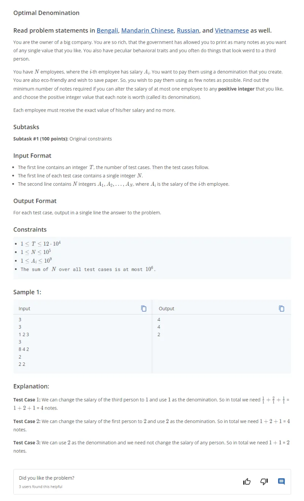

#### Explicación

Como es posible cambiar solo un elemento del array a 1 e imprimir una denominación de moneda para pagar el resto de elementos, entonces obtengo el mínimo de las siguientes operaciones:

- Para cada elemento del array sumo uno más la suma de todos los elementos menos el valor del elemento actual del array divida por el máximo común divisor de todo el resto de elementos distintos del elemento actual del array.

Para realizar lo anterior, se debe calcular un prefix y suffix de la operación máximo común divisor partiendo desde el primer elemento hacia el final y desde el final hacia el primer elemento, respectivamente. Con lo anterior es posible obtener el máximo común divisor del resto de elementos de manera sencilla.

```py
from math import gcd
# cook your dish here
t=int(input())
for case in range(t):
    n=int(input())
    arr=list(map(int,input().split()))

    if n==1:
        print(1)
    else:
        prefixGCD=[1]*n
        suffixGCD=[1]*n
        sumTotal=0
        for i in range(n):
            if i==0:
                prefixGCD[i]=arr[i]
                suffixGCD[n-1-i]=arr[n-1-i]
            else:
                prefixGCD[i]=gcd(prefixGCD[i-1],arr[i])
                suffixGCD[n-1-i]=gcd(suffixGCD[n-1-i+1],arr[n-1-i])

            sumTotal+=arr[i]

        minCount=float('inf')
        for i in range(n):
            if i==0:
                restGCD=suffixGCD[i+1]
            elif i==n-1:
                restGCD=prefixGCD[i-1]
            else:
                restGCD=gcd(suffixGCD[i+1],prefixGCD[i-1])
            count=1+(sumTotal-arr[i])//restGCD
            minCount=min(minCount,count)

        print(minCount)
```

Existe otra manera de simplificar las operaciones prefix y suffix evitando considerar extremos al incluir en los arrays respectivos el cero como primer elemento en prefix y como último elemento en suffix ya que cero es el elemento neutro de la operación máximo común divisor:

```py
from math import gcd
# cook your dish here
t=int(input())
for case in range(t):
    n=int(input())
    arr=list(map(int,input().split()))

    if n==1:
        print(1)
    else:
        prefixGCD=[0]*(n+1)
        suffixGCD=[0]*(n+1)
        sumTotal=0
        for i in range(n):
            prefixGCD[i+1]=gcd(prefixGCD[i],arr[i])
            suffixGCD[n-1-i]=gcd(suffixGCD[n-i],arr[n-i-1])
            sumTotal+=arr[i]

        minCount=float('inf')
        for i in range(n):
            restGCD=gcd(suffixGCD[i+1],prefixGCD[i])
            count=1+(sumTotal-arr[i])//restGCD
            minCount=min(minCount,count)

        print(minCount)
```

### Problema 10: Binod

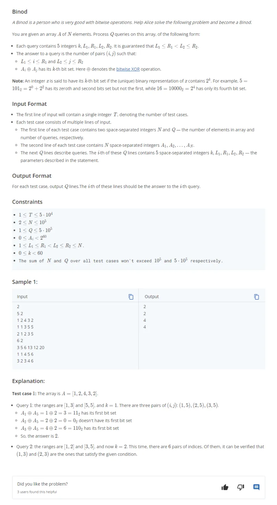

#### Explicación

El paso clave para resolver este problema es advertir que dados dos set A y B de elementos consecutivos tal que sean As la cantidad de elementos de A donde el k-th bit esta seteado y Au la cantidad de elementos de A donde el k-th bit NO esta seteado y Bs la cantidad de elementos de B donde el k-th bit esta seteado y Bu la cantidad de elementos de A donde el k-th bit NO esta seteado. El número de elementos tal que el k-th bit esta seteado es igual a:

- As \* Bu + Au \* Bs

Como nos dan un array para varios test cases entonces se crea un array de arrays tal que para cada k en el rango de valores posibles desde 0 a 59 se calculan sumas prefix donde el k-th bit este seteado y no seteado. Para ello he creado un array de diccionarios en que cada diccionario almacena dos arrays, uno para llevar el prefix sum donde el k-th esta seteado y el otro para llevar el prefix sum donde el k-th no este seteado. Luego en base a los rangos de valores dados en cada query se aplica la fórmula anterior: As \* Bu + Au \* Bs

```py
T=int(input())

for t in range(T):
    n,q=map(int,input().split())
    arr=list(map(int,input().split()))
    prefixSetUnset=[{"set":[0]*(n+1),"unset":[0]*(n+1)} for _ in range(60)]
    for k in range(60):
        for i in range(n):
            if arr[i]&(1<<k):
                prefixSetUnset[k]["set"][i+1]=prefixSetUnset[k]["set"][i]+1
                prefixSetUnset[k]["unset"][i+1]=prefixSetUnset[k]["unset"][i]
            else:
                prefixSetUnset[k]["set"][i+1]=prefixSetUnset[k]["set"][i]
                prefixSetUnset[k]["unset"][i+1]=prefixSetUnset[k]["unset"][i]+1

    for query in range(q):
        k,l1,r1,l2,r2=map(int,input().split())
        countSetBitBetweenL1R1=prefixSetUnset[k]["set"][r1]-prefixSetUnset[k]["set"][l1-1]
        countSetBitBetweenL2R2=prefixSetUnset[k]["set"][r2]-prefixSetUnset[k]["set"][l2-1]
        countUnsetBitBetweenL1R1=prefixSetUnset[k]["unset"][r1]-prefixSetUnset[k]["unset"][l1-1]
        countUnsetBitBetweenL2R2=prefixSetUnset[k]["unset"][r2]-prefixSetUnset[k]["unset"][l2-1]
        print(countSetBitBetweenL1R1*countUnsetBitBetweenL2R2+countSetBitBetweenL2R2*countUnsetBitBetweenL1R1)
```

### Problema 11:-Rectangular Queries

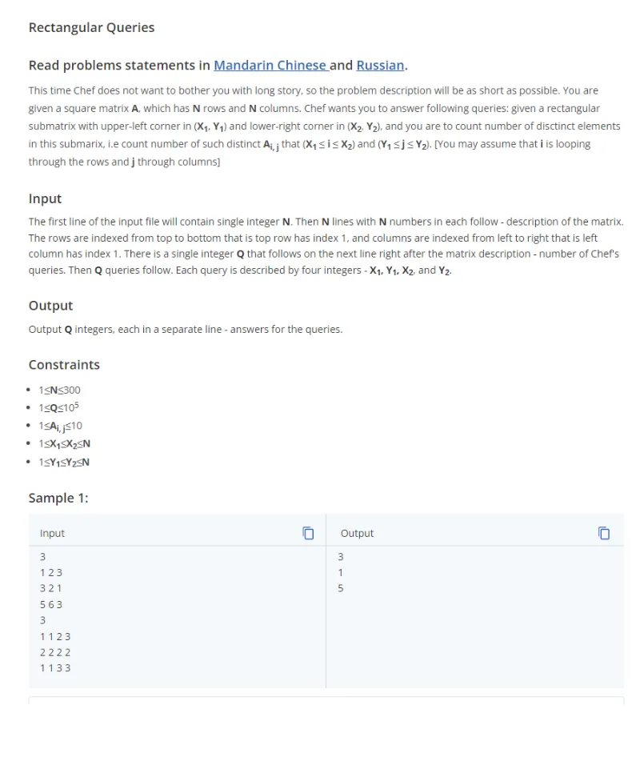

#### Explicación

El enfoque de resolución del problema utiliza el hecho de que cada elemento de la matriz esta dentro del rango 1 a 10 incluidas ambas cotas. En base a aquello se crea un array de largo 10 donde cada elemento es una matriz de tamaño n+1 por n+1. Cada matriz almacena la suma prefix de veces en que aparece cada elemento Ai en la matriz original dada para cada valor del rango de 1 a 10. Luego la solución consiste en recorrer el array de matrices y para cada rango ingresado en cada query, verificar si la suma prefix es mayor que cero. Si es mayor a cero, esto implica que el número aparece al menos una vez y un contador se incrementa en uno cada vez que esto ocurre para cada matriz en el array de matrices.

```py
n=int(input())
arr=[list(map(int,input().split())) for _ in range(n)]
q=int(input())
matrices=[[[0]*(n+1) for _ in range(n+1)] for _ in range(11)]

for k in range(1,11):
    for i in range(n):
        for j in range(n):
            if arr[i][j]==k:
                matrices[k][i+1][j+1]=1
    ## calculo de prefix count en la mismas matrices
    for i in range(n):
        for j in range(n):
            matrices[k][i+1][j+1]+=matrices[k][i][j+1]+matrices[k][i+1][j]-matrices[k][i][j]
for query in range(q):
    x1,y1,x2,y2=map(int,input().split())
    count=0
    for k in range(1,11):
        if matrices[k][x2][y2]-matrices[k][x2][y1-1]-matrices[k][x1-1][y2]+matrices[k][x1-1][y1-1]>0:
            count+=1
    print(count)
```

### Problema 12: Again XOR problem

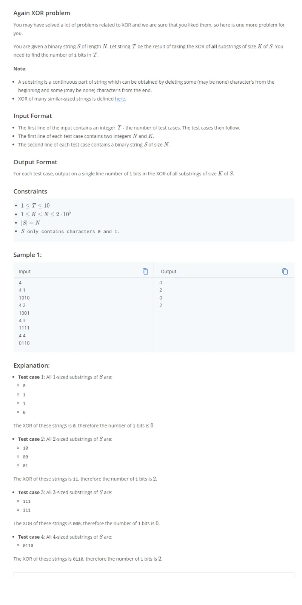

#### Explicación

Para resolver este problema se debe identificar la siguiente caracterización:

Sea, por ejemplo, S='1001' y sea k=2, entonces los substring de valores contiguos de largo 2 posibles son: '10','00' y '01'. Como nos piden el número de unos que resultan de la operación XOR entre todos estos elementos, entonces aquello se puede realizar obteniendo los XOR entre cada elemento de su respectivo índice en cada substring, es decir, se debería obtener el XOR entre '100' y sumar dicho valor al XOR entre '001'. Lo anterior, precisamente, es el XOR acumulado tomado por partes de la cadena S. Por lo tanto, el problema se resuelve en primer lugar creando un prefix XOR y luego obtener los XOR de los elementos en rangos de valores. Para ello se puede hacer uso de la siguiente propiedad:

- Sea R el XOR entre los elementos a1,a2,a3,...,an, entonces el XOR entre los elementos de posiciones i a n es igual al XOR entre los elementos de índices menores a i y R. Lo anterior se demuestra a partir de la siguiente identidad: A XOR A XOR B XOR C= B XOR C

```py
t=int(input())
for testcase in range(t):
    n,k=map(int,input().split())
    s=input()
    prefixXOR=[0]*(n+1)
    for i in range(n):
        prefixXOR[i+1]=prefixXOR[i]^int(s[i])

    count=0
    for i in range(k):
        count+=prefixXOR[i]^prefixXOR[i+n-k+1]

    print('val',count)
```

### Problema 13: Segmentation Fault

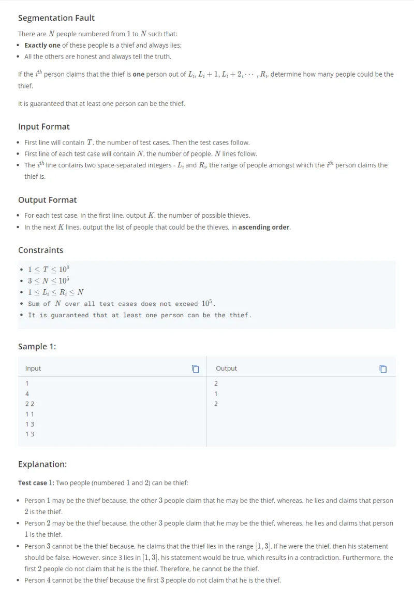

#### Explicación

El enfoque de resolución de este problema es recorrer cada persona y suponer que la persona respectiva es ladrón. Luego se debe comprobar en base a los rangos dados para esta persona y el resto, si es posible que esta persona sea ladrón. Si es posible, entonces un contador se incrementa en uno. Ahora bien, para que la persona i sea ladrón se debe verificar lo siguiente:

- El rango dado de personas posibles de ser ladrón dado para la persona i NO debe incluir a la persona i. Si dicho rango incluye a la persona i entonces el posible ladrón diría la verdad (ya que se esta incluyendo el mismo) pero dado que el ladrón siempre miente entonces se produce una contradicción.

- El rango de ladrones posibles para el resto de personas distintas de i DEBEN incluir a la persona i, es decir, cada rango debe incluir a dicha persona i.

La primera condición es sencilla de verificar. En cambio la segunda condición presenta mayor complejidad dado que se requiere crear un prefix y suffix de intersecciones. Los array de intersecciones prefix y suffix son de tamaño n+1 tal que el primer elemento en el array prefix es el elemento neutro de la operación intersección el cual es el conjunto universo que en este caso es el rango de 1 a n. El último elemento del array suffix es el mismo elemento neutro anterior. Los rangos e intersecciones los identifico como tuplas y las intersecciones vacías las identifico como None.

Una vez obtenidos los prefix y suffix de la operación intersección, se procede a recorrer cada posible ladrón desde la posición 1 a la n, verificando que:

- En primer lugar el rango de valores de esta persona no incluya a la persona. Si lo anterior no se cumple, continuar con la siguiente persona. Si lo anterior se cumple, continuar con la siguiente verificación.

- Verificar que la intersección de todos los rangos del resto de personas incluya a la persona actual.

Si ambas condiciones se cumplen, entonces aumentar el contador de posibles ladrones en uno.

```py
t=int(input())
for testcase in range(t):
    n=int(input())
    ranges=[]
    for line in range(n):
        l,r=map(int,input().split())
        ranges.append((l,r))
    prefixIntersection=[(1,n)]+[None]*n
    suffixIntersection=[None]*n+[(1,n)]
    for i in range(n):
        l,r=ranges[i]
        if prefixIntersection[i]:
            lBefore,rBefore=prefixIntersection[i]
            if max(l,lBefore)<=min(r,rBefore):
                prefixIntersection[i+1]=(max(l,lBefore),min(r,rBefore))
    for i in range(n-1,-1,-1):
        l,r=ranges[i]
        if suffixIntersection[i+1]:
            lBefore,rBefore=suffixIntersection[i+1]
            if max(l,lBefore)<=min(r,rBefore):
                suffixIntersection[i]=(max(l,lBefore),min(r,rBefore))
    count=0
    result=[]
    for i in range(1,n+1):
        l,r=ranges[i-1]
        if i<l or i>r:
            rangePrefix=prefixIntersection[i-1]
            rangeSuffix=suffixIntersection[i]
            if rangePrefix and rangeSuffix:
                if max(rangePrefix[0],rangeSuffix[0])<=i and i<=min(rangePrefix[1],rangeSuffix[1]):
                    count+=1
                    result.append(i)
    print(count)
    for i in result:
        print(i)
```

### Problema 14: Triplets Min

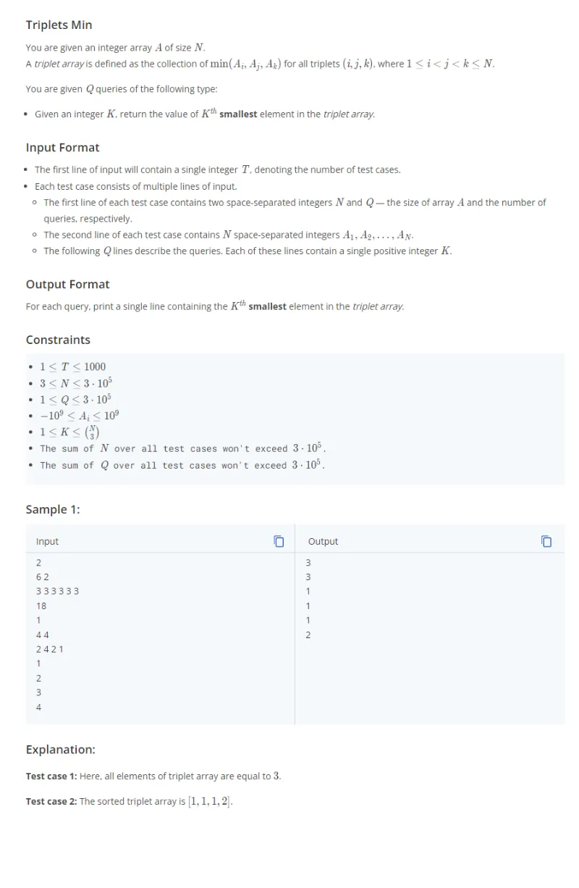

#### Explicación

El enfoque de resolución del problema consiste, en primer lugar, proceder a ordenar el array de elementos. Luego se advierte la siguiente propiedad:

Sea el array ordenado igual a 1,2,2,4,5 entonces tengo las siguientes tripletas:

- Para el índice 0 tengo: (1,2,2), (1,2,4), (1,2,5) luego (1,2,4), (1,2,5) y luego (1,4,5)
- Para el índice 1 tengo: (2,2,4), (2,2,5) y luego (2,4,5)
- Para el índice 2 tengo: (2,4,5)

Las cantidades anteriores son iguales a:

- Para el índice 0 tengo un total de 3\*4/2
- Para el índice 1 tengo un total de 2\*3/2
- Para el índice 2 tengo un total de 1\*2/2

En general, sea n la cantidad de elementos en el array entonces la cantidad de elementos para i desde n-2 hasta 1 es igual a i\*(i+1)/2. Creo un array que mantiene el total para cada índice anterior y luego obtengo un prefix sum array de sumadas acumuladas de totales. Para el ejemplo anterior, el array de cuentas sería: [6,3,1] luego el array prefix sum, siendo el primer elemento el elemento neutro de la adición, sería: [0,6,9,10]. Para buscar el k elemento más pequeño donde k es mayor o igual a 1 y entero, aplico una búsqueda binaria. Por ejemplo, para el array prefix anterior tengo que, para el índice 1, existen las siguientes posiciones para k posibles: 1,2,3,4,5,6; para el índice 2, existen las siguientes posiciones para k posibles: 7,8,9 y para el índice 3 existen las siguientes posiciones para k posibles: 10. Si quisiera buscar la posición 5, la búsqueda binaria hace lo siguiente:

- Puntero left es igual a 0 y puntero right es igual a 3 (primer y último índice respectivamente del array prefix).

- Cálculo de mid índice igual a 1.

- Verifico si 5 (k buscado) es mayor a prefix[mid]. Si es mayor entonces puntero left es igual a mid+1. Si es menor o igual, el puntero right es igual a mid. Como en este caso 5<6, el puntero right es igual a 1.

- Ahora el puntero left es igual a 0 y puntero right es igual a 1. Cálculo el nuevo puntero mid que es igual a 0.

- Verifico si 5 (k buscado) es mayor a prefix[mid]. En este caso, prefix[mid] es 0 por lo que 5>0, entonces puntero left es igual a left+1, es decir, puntero left es igual a 1.

- Ahora puntero left es igual a 1 y puntero right es igual a 1. Como son iguales se termina la iteración quedando el puntero left igual a 1. Como el prefix sum almacena valores partiendo de 1 a n, el valor que toma dicha posición en el array original es left menos uno.

```py
t=int(input())
for testcase in range(t):
    n,q=map(int,input().split())
    arr=list(map(int,input().split()))

    arr.sort()

    counts=[]

    for i in range(n-2,0,-1):
        counts.append(i*(i+1)//2)

    lengthCounts=len(counts)
    prefixSum=[0]*(lengthCounts+1)

    for i in range(lengthCounts):
        prefixSum[i+1]=prefixSum[i]+counts[i]

    for query in range(q):
        k=int(input())
        left=0
        right=lengthCounts
        while left<right:
            mid=(left+right)//2
            if k>prefixSum[mid]:
                left=mid+1
            else:
                right=mid
        print(arr[left-1])
```
