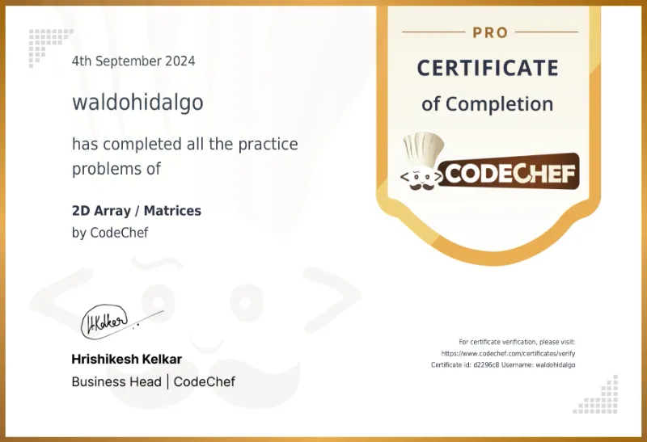

# Ejercicios y Proyectos Realizados para Codechef

Repositorio que contiene los ejercicios y proyectos requeridos para diversas rutas de aprendizaje que voy realizando en el tiempo. Subo todo lo realizado una vez que obtengo cada certificado.

## Tabla de Contenido

- [Ejercicios y Proyectos Realizados para Codechef](#ejercicios-y-proyectos-realizados-para-codechef)
  - [Tabla de Contenido](#tabla-de-contenido)
  - [Rutas Finalizadas](#rutas-finalizadas)
    - [Linked List](#linked-list)
      - [Certificado](#certificado)
    - [OOPS Concepts in Python](#oops-concepts-in-python)
      - [Certificado](#certificado-1)
    - [2D Array / Matrices](#2d-array--matrices)
      - [Ejercicios Resueltos](#ejercicios-resueltos)
      - [Certificado](#certificado-2)

## Rutas Finalizadas

### Linked List

En esta ruta se ejercitan linked list simples y dobles con punteros en el head y/o tail.

#### Certificado


### OOPS Concepts in Python

En la ruta se ejercitan conceptos como clases, clases abstractas, métodos estáticos, composition, atributos privados, protegidos y públicos, multithreads, handle files y generics.

#### Certificado


### 2D Array / Matrices

Se practican conceptos como reducción de tiempo de complejidad de algoritmos, implementación de breadth first search algorithm, depth first search algorithm, árboles binarios, dynamic programming entre otros junto con resolver todos los ejercicios de practica siguientes (más abajo muestro el código solo de los ejercicios resultos de dificultad Hard el resto de soluciones se encuentra en el repositorio en la carpeta Matrix):

#### Ejercicios Resueltos

1-Add Two Matrices

2-Zig-zag traversal

3-Upside Down Matrix

4-Sum of Diagonals

5-Count Negative Numbers

6-Multiplication of Two Matrices

7-Valid Matrix Sum

8-Sort Matrix Diagonally

```py
m,n=map(int,input().split())
matrix=[]
for i in range(m):
    matrix.append(list(map(int,input().split())))

def sortDiagonally(matrix):
    for k in range(n):
        i=0
        j=k
        temp=[]
        while i<m and j<n:
            temp.append(matrix[i][j])
            i+=1
            j+=1
        temp.sort()
        i=0
        j=k
        while i<m and j<n:
            matrix[i][j]=temp[i]
            i+=1
            j+=1

    for k in range(1,m):
        i=k
        j=0
        temp=[]
        while i<m and j<n:
            temp.append(matrix[i][j])
            i+=1
            j+=1
        temp.sort()
        i=k
        j=0
        while i<m and j<n:
            matrix[i][j]=temp[j]
            i+=1
            j+=1
    print("----")
    for i in range(m):
        for j in range(n):
            print(matrix[i][j],end=" ")
        print()

sortDiagonally(matrix)
```

9-Set Matrix Zeroes

10-Matrix Rotations

11-Row With Maximum Ones

12-Equal Rows and Columns

13-Path With Minimum Sum

```py
n,m=map(int,input().split())
matrix=[]
for i in range(n):
    matrix.append(list(map(int,input().split())))


memo=[[0 for j in range(m)] for i in range(n)]


for i in range(n):
    for j in range(m):
        if i==0 and j==0:
            memo[i][j]=matrix[i][j]
        elif i==0:
            memo[i][j]=memo[i][j-1]+matrix[i][j]
        elif j==0:
            memo[i][j]=memo[i-1][j]+matrix[i][j]
        else:
            memo[i][j]=min(memo[i-1][j],memo[i][j-1])+matrix[i][j]

print(memo[n-1][m-1])
```

14-Maximal square of all ones (Hard)

```py
n=int(input())

matrix=[list(map(int,input().split())) for _ in range(n)]

def maxSquare(i,j,matrix,n):
    maxCount=1 if matrix[i][j]==1 else 0
    isSquare=True if matrix[i][j]==1 else False
    k=1
    while isSquare and i+k<=n and j+k<=n:
        i1=i
        while i1<n and i1<i+k and isSquare:
            j1=j
            while j1<n and j1<j+k and isSquare:
                if matrix[i1][j1]==0:
                    isSquare=False
                j1+=1
            i1+=1
        if not isSquare:
            break
        maxCount=max(maxCount,k)
        k+=1
    return maxCount

maxSquareMatrix=0
for i in range(n):
    for j in range(n):
        if matrix[i][j]==1:
            maxSquareMatrix=max(maxSquareMatrix,maxSquare(i,j,matrix,n))

print(maxSquareMatrix**2)
```

15-Print Matrix In Spiral Fashion (Hard)

```py
matrix=[[1,2,3,4],
        [5,6,7,8],
        [9,10,11,12],
        [13,14,15,16],
        [17,18,19,20]]

n=len(matrix)
m=len(matrix[0])

row,col=n,m
movements=[[0,1],[1,0],[0,-1],[-1,0]]
i,j=0,0
currentMovement=0
maxValues=[m,n]
while maxValues[0]>0 and maxValues[1]>0 :
    counts=[0,0]
    for k in range(2):
        while counts[k]<maxValues[k]:
            print(matrix[i][j],end=" ")
            counts[k]+=1
            if counts[k]==maxValues[k]:
                currentMovement=(currentMovement+1)%4
            i,j=i+movements[currentMovement][0],j+movements[currentMovement][1]
        maxValues=[maxValues[0]-abs(movements[currentMovement][1]),maxValues[1]-abs(movements[currentMovement][0])]
```

16-Maximum Area Island

17-Rotting Apples (Hard)

```py
from collections import deque

n,m=map(int,input().split())
matrix=[list(map(int,input().split())) for _ in range(n)]

def bfs(q,matrix):
    time=0
    while q:
        for _ in range(len(q)):
            i,j=q.popleft()

            if i+1<n and matrix[i+1][j]==1:
                matrix[i+1][j]=2
                q.append((i+1,j))

            if j+1<m and matrix[i][j+1]==1:
                matrix[i][j+1]=2
                q.append((i,j+1))

            if i-1>=0 and matrix[i-1][j]==1:
                matrix[i-1][j]=2
                q.append((i-1,j))

            if j-1>=0 and matrix[i][j-1]==1:
                matrix[i][j-1]=2
                q.append((i,j-1))

        time+=1
    return time-1
q=deque()

for i in range(n):
    for j in range(m):
        if matrix[i][j]==2:
            q.append((i,j))

minRotting=bfs(q,matrix)

for i in range(n):
    for j in range(m):
        if matrix[i][j]==1:
            minRotting=-1
            break

print(minRotting)
```

18-Search In Matrix

19-Distance to Nearest 0 (Hard)

```py
from collections import deque

n,m=map(int,input().split())
matrix=[list(map(int,input().split())) for _ in range(n)]

aux=[[float('inf')]*m for _ in range(n)]

queue=deque()

for i in range(n):
    for j in range(m):
        if matrix[i][j]==0:
            aux[i][j]=0
            queue.append((i,j))

while queue:
    i,j=queue.popleft()

    if i+1<n and aux[i+1][j]>aux[i][j]+1:
        aux[i+1][j]=aux[i][j]+1
        queue.append((i+1,j))

    if j+1<m and aux[i][j+1]>aux[i][j]+1:
        aux[i][j+1]=aux[i][j]+1
        queue.append((i,j+1))

    if i-1>=0 and aux[i-1][j]>aux[i][j]+1:
        aux[i-1][j]=aux[i][j]+1
        queue.append((i-1,j))

    if j-1>=0 and aux[i][j-1]>aux[i][j]+1:
        aux[i][j-1]=aux[i][j]+1
        queue.append((i,j-1))

for i in range(n):
    for j in range(m):
        print(aux[i][j],end=" ")
    print()
```

20-Median in Matrix

21-Spiral rotation

#### Certificado


